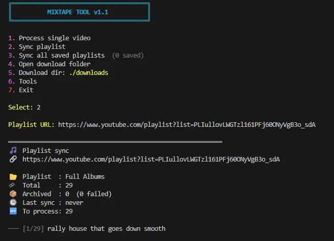

# Mixtape Tool

Downloads YouTube DJ sets and mixtapes as properly split MP3 track collections.

Paste in a video URL and it figures out the tracklist — from official YouTube chapters or the video description — downloads the audio, and cuts it into individual numbered files. A `.m3u8` playlist is generated automatically. Handles single videos or entire playlists, with archive tracking so repeated runs only grab what's new.

---



## Features

- Extracts tracklists from YouTube chapters, video descriptions, and pinned comments
- Handles a wide range of timestamp formats (`[MM:SS]`, `HH:MM:SS`, numbered lists, pipe-separated, and more)
- Generates an `.m3u8` playlist alongside the split tracks
- Per-playlist sync archive — previously processed videos are skipped automatically
- Filename sanitization for broad MP3 player compatibility, including budget and older firmware
- Supports non-Latin filenames (Korean, Japanese, Chinese, Arabic, etc.)
- Interactive terminal menu for casual use; full CLI for scripting and scheduling
- Retry and force-reprocess tools for managing failed downloads

## Requirements

- Python 3.10+
- [yt-dlp](https://github.com/yt-dlp/yt-dlp)
- [ffmpeg](https://ffmpeg.org/)

## Usage

```bash
# Interactive menu
python mixtape_tool.py

# Single video
python mixtape_tool.py --video "https://www.youtube.com/watch?v=..."

# Sync a playlist
python mixtape_tool.py --playlist "https://www.youtube.com/playlist?list=..."

# Preview without downloading
python mixtape_tool.py --playlist "https://..." --dry-run
```

## Output

```
downloads/
├── Playlist Name/
|   ├── sync_archive.json
|   └── Video Title - Channel/
|       ├── 01 - Track Name.mp3
|       ├── 02 - Track Name.mp3
|       ├── Video Description.description
|       └── Video Title - Channel.m3u8
|
└── Single Video Title - Channel/
    ├── 01 - Track Name.mp3
    ├── 02 - Track Name.mp3
    ├── Video Description.description
    └── Video Title - Channel.m3u
```

## Files

| File | Description |
|---|---|
| `mixtape_tool.py` | Main entry point — interactive menu and CLI |
| `mixtape_splitter.py` | Core library — can be imported independently |

See [`mixtape_tool.md`](mixtape_tool.md) for full usage documentation and [`mixtape_splitter.md`](mixtape_splitter.md) for the library API reference.
